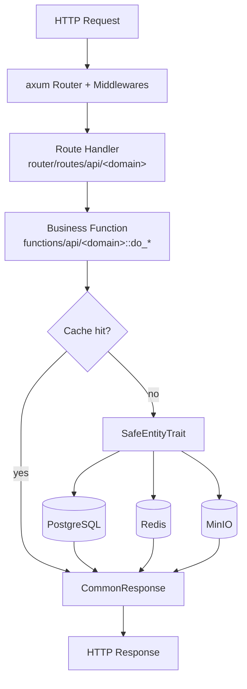

# 架構概覽

> [← 返回索引](../README.md) · 構建請見 [構建指南](./building.md)

本項目是一個 `axum` + `sea-orm` 的單體後端，按四個 Cargo 包自底向上分層。依賴
方向嚴格單向：`router → functions → database → utils`，任何反向引用都會在編譯
期被發現。

## 四包分層

| 包 | 職責 | 關鍵內容 |
| --- | --- | --- |
| `utils` | 通用基礎 | DTO/VO 類型（`src/types/`、`src/models/`）、`SafeEntityTrait` 宏、JWT、`CommonResponse` 包裝 |
| `database` | 數據訪問 | sea-orm 實體，按域組織於 `src/models/<domain>/`，全局 `DB_CONN` 連接池 |
| `functions` | 業務邏輯 | `src/functions/api/<domain>.rs` 提供 `do_*` 異步函數，編排實體讀寫與緩存 |
| `router` | 接入層 | axum 路由 `src/routes/api/<domain>/`、中間件（鑑權、IP 提取、User-Agent 提取）、二進制 `_router` |

## 請求流

```text
HTTP 請求
  │
  ▼
axum Router（tower 中間件鏈：tracing / CORS / ExtractAuthInfo）
  │
  ▼
路由處理函數  packages/router/src/routes/api/<domain>/<op>.rs
  │   提取 ExtractAuthInfo + Json/Path
  ▼
業務函數      packages/functions/src/functions/api/<domain>.rs :: do_*
  │   編排校驗、緩存查詢、實體讀寫
  ▼
SafeEntityTrait  packages/utils/src/db_operations.rs
  │   find_safety / update_safety / delete_safety（軟刪除 + 樂觀鎖）
  ▼
sea-orm ─► PostgreSQL      redis（緩存）      minio（對象存儲）
```

對應的 mermaid 圖：



## SafeEntityTrait 模式

所有內容域實體通過 `impl_safe_operation!` 宏（`packages/utils/src/db_operations.rs`）
獲得三個安全操作：`find_safety`（過濾 `del_flag=false`）、`update_safety`（帶
`version` 樂觀鎖，`WHERE version = last_version` 並自增）、`delete_safety`（置
`del_flag=true` 軟刪除）。宏還把 `ActiveModelBehavior::before_delete` 改爲直接
報錯，從而在編譯期之外、運行期禁止硬刪除。這套模式是 Rust 側對 Java 側
`BaseEntity` + MyBatis-Plus 邏輯刪除/樂觀鎖的對齊實現。

## Redis 與 MinIO 集成點

- **Redis**：`packages/functions/src/functions/api/cache.rs` 暴露按域的緩存刷新端點
  （area、item、marker、`icon_tag`、notice 等），`router/src/routes/api/cache/`
  對應路由。`*_doc` 歸檔頁經 moka 進程內緩存 + Redis 二級緩存加速，命中時
  零數據庫查詢（見 [BinaryMD5 歸檔導出](../designs/binarymd5-archive-export.md)）。

- **MinIO**：`router/src/routes/api/res/upload.rs` 處理資源上傳（圖標、圖片等）。
  `bz2doc` 桶已預置，規劃中用於 BinaryMD5 歸檔存儲。

- **歸檔導出（`*_doc`）**：`item_doc` / `marker_doc` / `marker_link_doc` 端點從
  PostgreSQL 實時生成 GZIP 壓縮的 JSON 數據，以壓縮字節的 MD5 爲鍵供客戶端
  增量同步（對應 Java 側 BinaryMD5 壓縮歸檔管線）。
