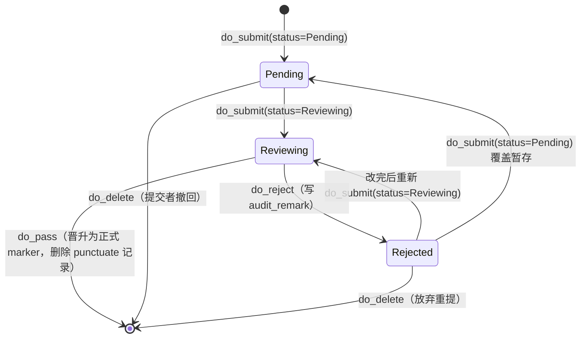

<!-- markdownlint-disable MD033 MD041 -->

# 打点审批工作流（Punctuate Workflow）

> [← 设计文档索引](./README.md) · 相关：[BinaryMD5 归档导出](./binarymd5-archive-export.md) · [隐藏/特殊标记](./hidden-and-special-flags.md)

本文解释「玩家打点 → 编辑审核 → 晋升为正式点位」这条状态机为什么长这样，
以及 Rust 侧 `punctuate` / `punctuate_audit` 两个业务模块如何对齐 Java 参考
实现。源码位置：

- 提交侧：`packages/functions/src/functions/api/punctuate.rs`
- 审核侧：`packages/functions/src/functions/api/punctuate_audit.rs`
- 暂存实体：`packages/database/src/models/marker/marker_punctuate.rs`
- 正式点位实体：`packages/database/src/models/marker/marker.rs`
- 路由：`packages/router/src/routes/api/punctuate/actions.rs`

## 1. 为什么需要这套流程

空荧酒馆地图的点位数据不是官方提供的，而是**全靠玩家众包贡献**：蒙德城外那个
风神瞳在哪、稻妻某岛屿的雷神瞳要从哪个悬崖飞过去、层岩巨渊深处的奇馈宝箱刷新
点是几点，这些知识都来自成千上万玩家在地图上一颗一颗点出来的。一旦点位上线，
全服玩家都会按图索骥去拿——如果点位错了（坐标偏了、物品标错、甚至有人故意乱标），
影响面是全服的。

所以后端不能让玩家直接写正式 `marker` 表。社区地图的通行做法是：**贡献者提交
一个「打点建议」（punctuate），由编辑团队人工审核通过后，才晋升为正式点位**。
这层审核既是质量把关（坐标准不准、说明清不清楚、截图是不是这个点），也是防破坏
（挡掉恶作剧坐标、广告文案、剧透未上线内容的点位）。

这条「暂存—审核—晋升」管线，是社区地图区别于普通 CRUD 后端的核心业务逻辑，
也是 `score_stat` 贡献评分（见 [第 6 节](#6-贡献评分的汇入)）的数据来源。

## 2. 两个表为什么要分离

打点建议存在独立的 `marker_punctuate` 表，**不直接动 `marker` 表**。这是有意为之：

- **隔离风险**：`marker` 表是全服客户端拉取的权威数据源（经 BinaryMD5 归档

分发给所有用户，见 [归档导出文档](./binarymd5-archive-export.md)）。把未审核
内容混进去，等于让每个玩家都能污染全服冷启动数据。分离后，即便审核管线出 bug，
正式点位也不会被动到。

- **保留意图**：一条 punctuate 记录不仅有点位数据，还带着 `method_type`（这次

是新增 / 修改 / 删除哪个点）、`original_marker_id`（针对哪个已有点位）、
`author`（提交者，用于评分）、`status` / `audit_remark`（审核状态和驳回理由）。
这些字段对正式点位没意义，是「一次贡献动作」的元数据，理应单独存。

- **可回溯**：驳回的 punctuate 不会消失（状态变 `Rejected`），提交者能看到驳回

理由、改完重提；编辑侧也能翻历史。如果直接写 `marker` 表就丢掉了这层轨迹。

`marker_punctuate.Model` 的关键字段（`packages/database/src/models/marker/marker_punctuate.rs`）：

| 字段 | 含义 |
| --- | --- |
| `punctuate_id` | 提交者侧的打点 ID（前端生成，幂等键） |
| `original_marker_id` | 仅 `Modified`/`Deleted` 有值，指向要改的正式点位 |
| `method_type` | `Added` / `Modified` / `Deleted`，决定晋升路径 |
| `status` | `Pending` / `Reviewing` / `Rejected`，状态机当前态 |
| `author` / `marker_creator_id` / `picture_creator_id` | 贡献者，用于评分与归属 |
| `audit_remark` | 驳回理由，回填给提交者 |
| `hidden_flag` | 该点位的可见性，晋升时一并带过去（见 [标记文档](./hidden-and-special-flags.md)） |

## 3. 状态机：三个状态

打点记录的生命周期由 `MarkerPunctuateStatus`（`packages/utils/src/types/marker.rs`）
驱动，只有三个状态：



| 状态 | 枚举值 | 含义 |
| --- | --- | --- |
| **Pending（暂存）** | `0` | 提交者在草稿箱里攒的点位，编辑侧看不到、不会审核 |
| **Reviewing（审核中）** | `1` | 已正式提交，等待编辑处理。这是审核队列里唯一可见的状态 |
| **Rejected（不通过）** | `2` | 编辑驳回，附 `audit_remark`。**不是终态**——提交者改完后可重新提交 |

「`Rejected` 不是终态」这点最容易踩坑。社区地图鼓励持续贡献：一个点位这次
坐标被驳回，提交者补张截图、挪正坐标后应该能继续走同一条 `punctuate_id` 重提，
而不是被迫新建一条丢掉上下文。所以 `do_submit` 在 `Pending` 和 `Rejected` 两个
状态上都允许继续操作。

代码里还硬性禁止了「直接把状态设成 `Rejected`」（`punctuate.rs:71`）——驳回只能
通过 `do_reject` 走，保证 `audit_remark` 一定被写上。

## 4. method_type：三种晋升路径

一条 punctuate 到底是「我想加个新点」还是「我想改这个旧点」还是「这个点已经没了
该删掉」，由 `MarkerPunctuateMethodType`（`packages/utils/src/types/marker.rs:51`）
区分。审核通过（`do_pass`）时，三种类型走完全不同的晋升逻辑：

| method_type | 数值 | `do_pass` 做什么 |
| --- | --- | --- |
| **Added（新增）** | `1` | 把 punctuate 的字段插入 `marker` 表，得到新 `marker.id` |
| **Modified（修改）** | `2` | 按 `original_marker_id` 找到正式点位，用 punctuate 字段覆盖后 `update_safety` |
| **Deleted（删除）** | `3` | 按 `original_marker_id` 找到正式点位，`delete_safety` 软删除 |

三条路径在晋升后**都会硬删除 `marker_punctuate` 记录**（`mp_model::Entity::delete_by_id`）。
原因：punctuate 表是「待办队列」，晋升成功意味着这次贡献已落地，记录留在队列里
只会让审核列表越来越长、且无法和正式点位对应。注意这里是硬删 punctuate（它已经
完成使命），而正式点位走的是软删（`del_flag`，见 [标记文档](./hidden-and-special-flags.md#41-与软删除-`del_flag`-的正交关系)）——
两套删除策略分别服务不同目的。

`Modified` 的字段覆盖是「非空才覆盖」的（`punctuate_audit.rs:150` 起对 `picture` /
`video_path` 做了 `if is_some` 判断），这样提交者只想改坐标时不会把原图清掉。
`Modified` / `Deleted` 都要求 `original_marker_id` 必须存在且能查到对应正式点位，
否则报错——防止贡献者指向一个已被别人删掉的点位。

## 5. 完整流转

一次典型的贡献走完整条管线：

```text
玩家在前端发现一个漏标的风神瞳
  │
  ▼  do_submit(status=Pending)        新建/覆盖一条暂存（草稿箱）
Pending ─────────────────────────►
  │  玩家补好截图、确认坐标
  ▼  do_submit(status=Reviewing)      COMMIT：状态转审核中
Reviewing ────────────────────────►   进入编辑审核队列
  │
  ├──► do_pass                        编辑核对无误 → 晋升
  │       Added → insert marker        正式点位上线，全服可见
  │       Modified → update marker     坐标修正生效
  │       Deleted → 软删 marker        点位下线
  │       (三种都 delete punctuate)    队列清空，贡献计入 score_stat
  │
  └──► do_reject(audit_remark)        编辑驳回，写理由
          Reviewing → Rejected
            │  玩家看到理由，修改坐标/补图
            └─► do_submit(status=Reviewing)  重新进入审核队列
```

提交者随时可用 `do_delete` 撤回自己 `Pending` 的暂存，或放弃 `Rejected` 的记录。
审核侧 `do_delete`（`punctuate_audit.rs:211`）则用于清理审核队列里的无效条目
（同样是软删 punctuate 记录本身）。

## 6. 贡献评分的汇入

审核通过的打点最终会汇入 `score_stat`（贡献者评分聚合表）。`score.rs` 的
`do_generate_score` 是一条批处理管线：

1. 按 `scope` + `span` + 时间范围，软删 `score_stat` 里的旧聚合行；
1. 扫描 `history` 表（编辑类型 = 打点 / 点位，对应 Java 侧 `type=4`）在时间窗内的

记录；

1. 按 `creator_id`（即贡献者）分桶，统计每个人的贡献次数；
1. 每个贡献者写一行进 `score_stat`，作为评分基数。

这条管线把「打点 → 审核 → 晋升 → 计入评分」闭环连起来：玩家打的点越多、通过率
越高，`score_stat` 里的分数越高，社区里就能识别出靠谱的贡献者。评分按 Java
`ScoreDataPunctuateVo` 的语义做了**字段级加权**：每条打点记录的权重 = 其内容
JSON 的字段数（改动规模越大分越高），Rust 侧在 `score.rs` 的 `entry_weight`
实现（`Added`/`Modified` 按字段数、`Deleted` 计 1、解析失败计 1）。

## 7. 与 Java 实现的对齐

| Java（`java-genshin-map-cloud`） | Rust |
| --- | --- |
| `PunctuateService.stage` | `punctuate::do_submit(status=Pending)` |
| `PunctuateService.commit` | `punctuate::do_submit(status=Reviewing)` |
| `PunctuateAuditService.passPunctuate` | `punctuate_audit::do_pass`（三路晋升） |
| `PunctuateAuditService.rejectPunctuate` | `punctuate_audit::do_reject` |
| `PunctuateDao` 操作 `marker_punctuate` 表 | `marker_punctuate` sea-orm 实体 + `SafeEntityTrait` |

Rust 侧复用了 `SafeEntityTrait` 的软删除 + 乐观锁语义（见
[架构概览](../guides/architecture.md#safeentitytrait-模式)），所以 punctuate 记录的
`del_flag` / `version` 行为和 Java 的 MyBatis-Plus 逻辑删除/乐观锁一致。晋升路径
（Added→insert、Modified→update、Deleted→软删 + 三路都删 punctuate）与 Java
`passPunctuate` 严格一一对应。

## 8. 已知简化与后续待办

- **RSA/JWKS 轮换**：token 签名为 HMAC-SHA256（JWKS 以 `oct` 形式公布密钥）；
  Java 侧为 RSA 密钥对 + JWK 轮换，切换时需引入密钥管理与轮换机制。
